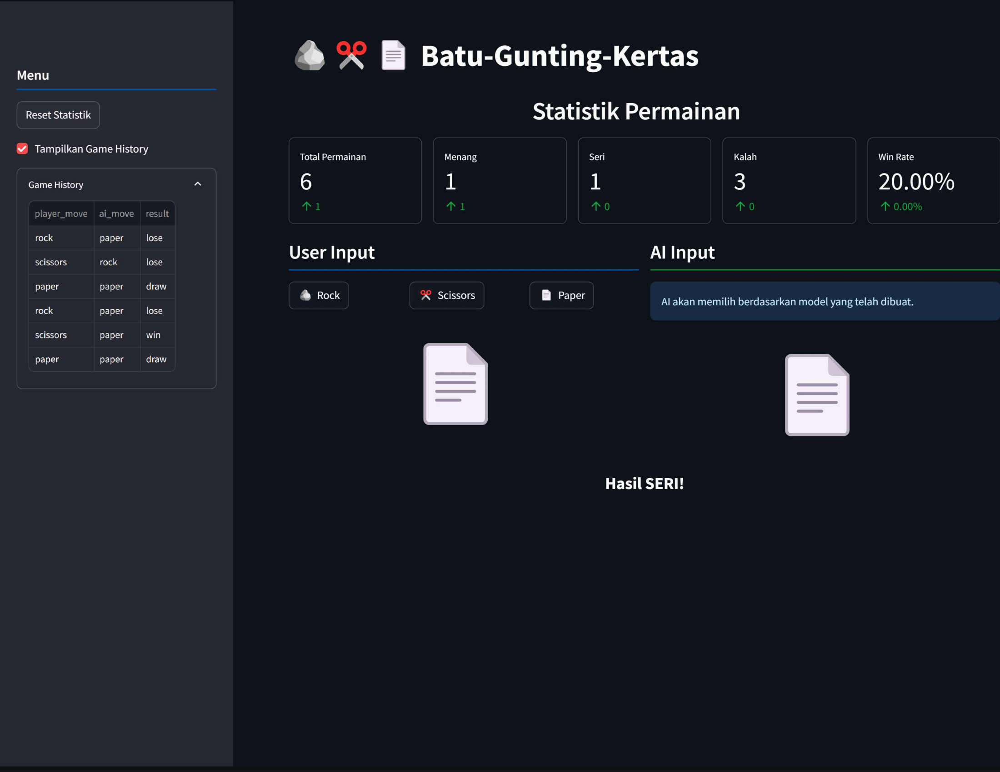
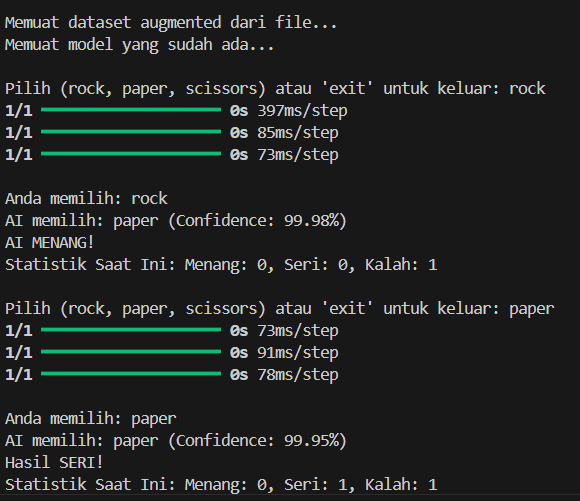

# 🪨✂️📝 Rock Paper Scissors Deep Learning

## 📌 Deskripsi Proyek
Proyek ini adalah implementasi permainan **Batu-Gunting-Kertas** berbasis **AI** menggunakan **Streamlit** sebagai antarmuka pengguna. Model kecerdasan buatan yang digunakan adalah **Deep Learning dengan TensorFlow**, yang dilatih untuk memprediksi gerakan terbaik berdasarkan riwayat permainan sebelumnya.

---

## 💒 Struktur Direktori
```
RockPaperScissor/
|
│── docs/
│   ├── images/              # Gambar untuk dokumentasi
|   |   ├── terminal.png     # Screenshot permainan di terminal
|   |   ├── streamlit.png    # Screenshot aplikasi Streamlit
│── src/
│   ├── artifacts/             # Hasil keluaran model dan grafik
│   │   ├── history_plot.png   # Grafik riwayat permainan
│   │   ├── history.csv        # Riwayat permainan dalam bentuk CSV
│   ├── data/                  # Dataset yang digunakan
│   │   ├── augmented_dataset.csv
│   │   ├── dataset.py         # Skrip pemrosesan data
│   ├── models/                # Model pembelajaran mesin
│   │   ├── mlp_model.keras    # Model yang sudah dilatih
│   │   ├── model.py           # Skrip untuk melatih model
│   ├── notebook/              # Notebook untuk pelatihan model
│   ├── main.py                # Skrip utama aplikasi (dapat dijalankan di terminal)
│── .gitignore                 # File untuk mengabaikan file yang tidak perlu dalam Git
│── readme.md                  # Dokumentasi proyek
│── requirements.txt            # Daftar dependensi Python
│── streamlit_app.py            # Aplikasi Streamlit untuk bermain game
```

---

## 🚀 Cara Menjalankan Proyek

### 1️⃣ **Kloning Repository**
```sh
git clone https://github.com/fillahalamsyah/RockPaperScissor.git
cd RockPaperScissor
```

### 2️⃣ **Buat Virtual Environment (Opsional tapi Disarankan)**
```sh
python -m venv venv
source venv/bin/activate  # Untuk MacOS/Linux
venv\Scripts\activate     # Untuk Windows
```

### 3️⃣ **Instal Dependensi**
```sh
pip install -r requirements.txt
```

### 4️⃣ **Menjalankan Aplikasi Streamlit**
```sh
streamlit run streamlit_app.py
```
Aplikasi akan berjalan di browser secara otomatis.




### 5️⃣ **Menjalankan Game di Terminal**
```sh
python src/main.py
```
Game dapat dijalankan langsung di terminal tanpa antarmuka Streamlit.



---

## 🧠 Cara Kerja AI
1. **Dataset**: Berisi gerakan pemain sebelumnya dalam bentuk CSV.
2. **Model**: Menggunakan **Deep Learning dengan TensorFlow**.
3. **Prediksi**: AI menganalisis pola gerakan pemain dan memilih langkah terbaik dengan probabilitas tertentu.
4. **Randomness**: Agar tidak terlalu mudah ditebak, AI memiliki faktor keacakan sebesar **30%**.

---

## 📊 Statistik dan Riwayat Permainan
- **Total permainan**
- **Jumlah menang, seri, dan kalah**
- **Win rate pemain**
- **Riwayat gerakan pemain & AI dalam tabel**

Semua data ini akan ditampilkan di sidebar aplikasi Streamlit.

---

## 🤖 Model Pembelajaran Mesin
- **Model**: `Deep Learning dengan TensorFlow`
- **Dataset Augmentasi**: `augmented_dataset.csv`
- **Hasil Pelatihan**: `mlp_model.keras`
- **Kode Model**: `src/models/model.py`
- **Notebook Pelatihan**: `src/notebook/training.ipynb`

---

## 🛠️ Teknologi yang Digunakan
- **Python 3.12.8** 🐍
- **Streamlit** 🎨 (UI/UX)
- **TensorFlow** 🤖 (Deep Learning)
- **Scikit-Learn** 📊 (Label Encoding)
- **NumPy & Pandas** 📊 (Data Processing)
- **Matplotlib** 📈 (Visualization)

---

## 📌 TODO List
- ✅ Implementasi model AI
- ✅ Menampilkan statistik permainan
- ✅ Menyimpan riwayat permainan
- ⬜ Menambahkan mode multiplayer
- ⬜ Optimasi model dengan lebih banyak data

---

## 🤝 Kontribusi
Jika ingin berkontribusi, silakan fork repository ini, buat branch baru, dan ajukan **pull request**!

```sh
git checkout -b fitur-baru
git add .
git commit -m "Menambahkan fitur baru"
git push origin fitur-baru
```

---

## 📞 Kontak
Jika ada pertanyaan atau saran, silakan hubungi:

💎 Email: fillahall@gmail.com

🔗 LinkedIn: [Fillah Alamsyah](https://www.linkedin.com/in/fillah-alamsyah)

---

🌟 **Selamat bermain!** 🎉
